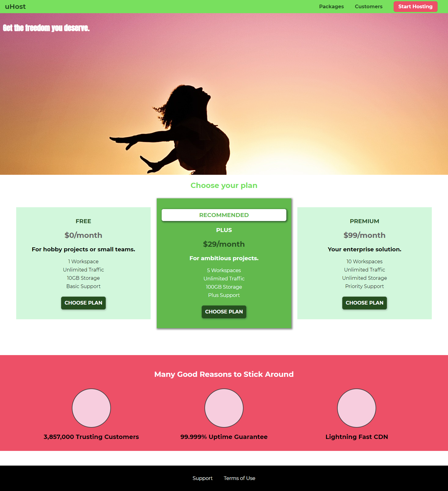

## CSS training

This repository is a sequence of pages created with HTML and CSS for learning purposes, guided by the _CSS - The Complete Guide 2020_ course.

Follows below some screenshots of the pages being developed.

- Version 1

- Version 2

